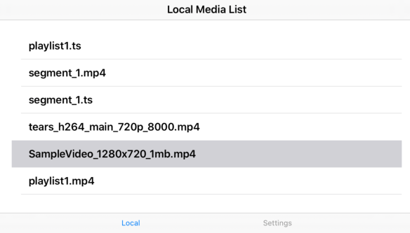
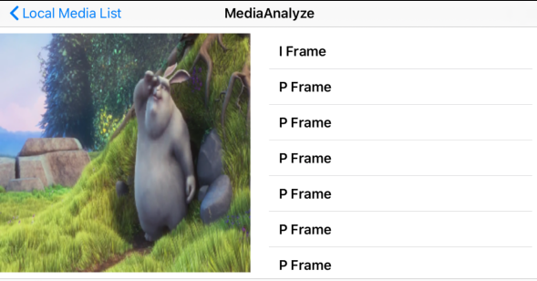

# ios_MediaAnalyzer
iOS Media Analysis Application

인코딩된 미디어 스트림을 분석해주는 미디어 전문가용 iOS 어플리케이션

## How to Run These Application
Add FAT FFMpeg Library
1. Download FAT FFMpeg Library: https://drive.google.com/drive/folders/1-IGDmQNRM2WqrevR6X4BvM-jcoZHxeia?usp=sharing
2. Make 'lib' directory in root path
3. Add 7 static library to 'lib' directory